<a href="https://aimeos.org/">
    
</a>

# JynDev - Dotfiles 🚀

<div align="center">

<a href="https://gowebly.org" target="_blank" title="Logo hyprland"></a>

<a name="readme-top"></a>

# Mi configuración disponible para todos 👨🏻‍💻​🛠️​

En este repositorio se ponen a disposición del público en general todos los scripts y archivos de configuración de mi sistema operativo actual. Ten en cuenta que estoy comenzando en este tema, por lo que la instalación podría resultar un poco confusa.

**&searr;&nbsp;&nbsp;Sigueme en mis redes sociales;&nbsp;&swarr;**
[![Share on TikTok][image_tiktok]][link_tiktok]

<a href="https://gowebly.org" target="_blank" title="Go to the Gowebly CLI website"></a>

## 🖼️ Resultados
</div>

🌟 **Escritorio**
<div align="center">
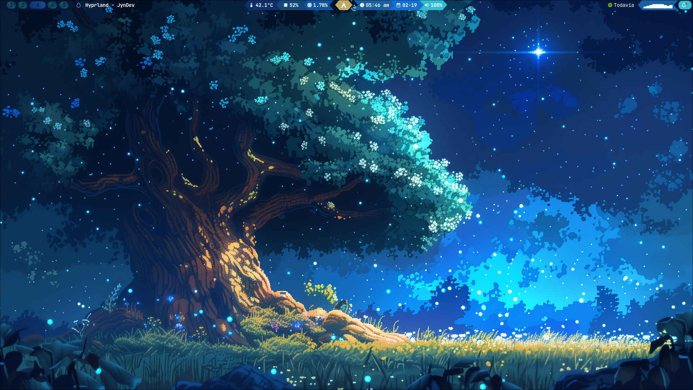</img> 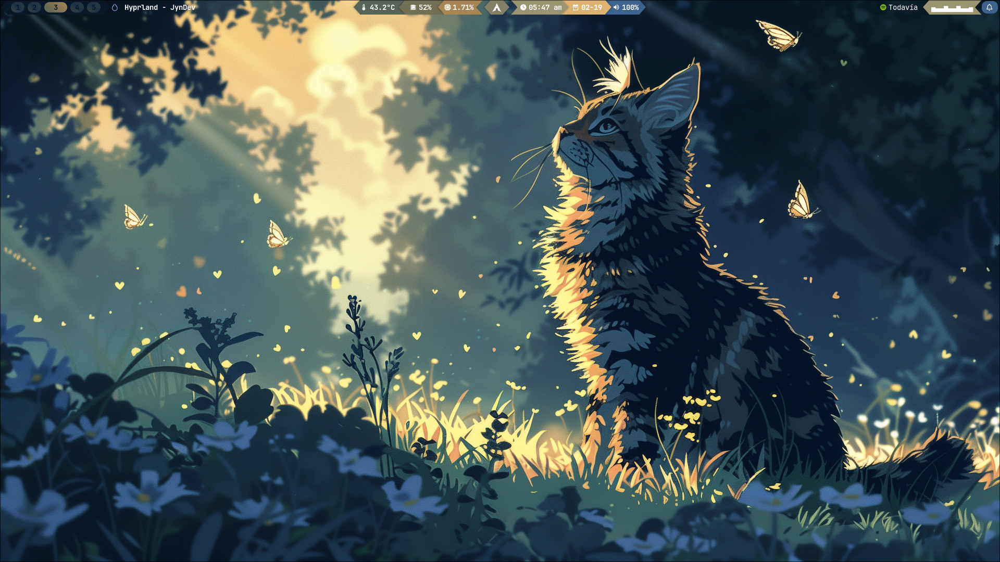</img> 
</div>


🌠 **Explorador de archivos (Nemo)**
<div align="center">
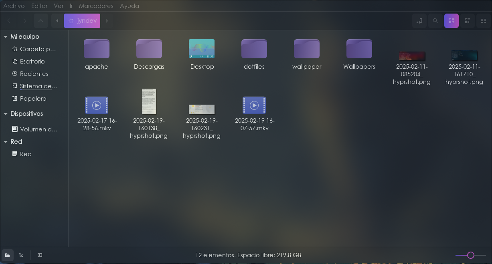</img> 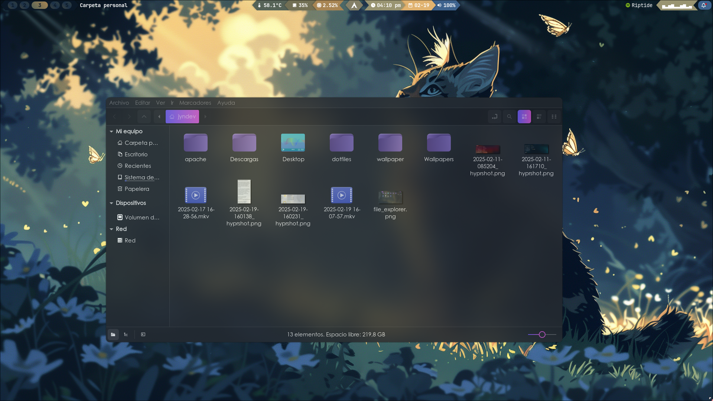</img> 
</div>

🐱‍💻 **Terminal (Kitty)**
<div align="center">
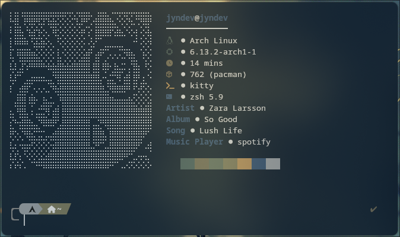</img> 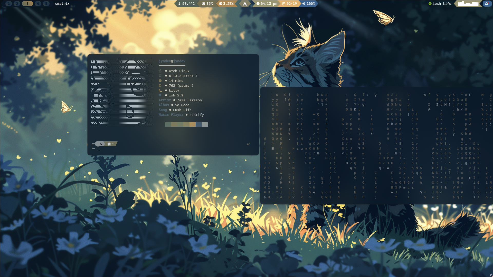</img> 
</div>

💫 **Lanzador de aplicaciones (Rofi)**
<div align="center">
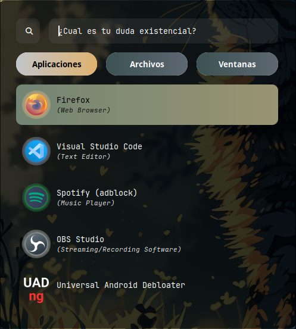</img> 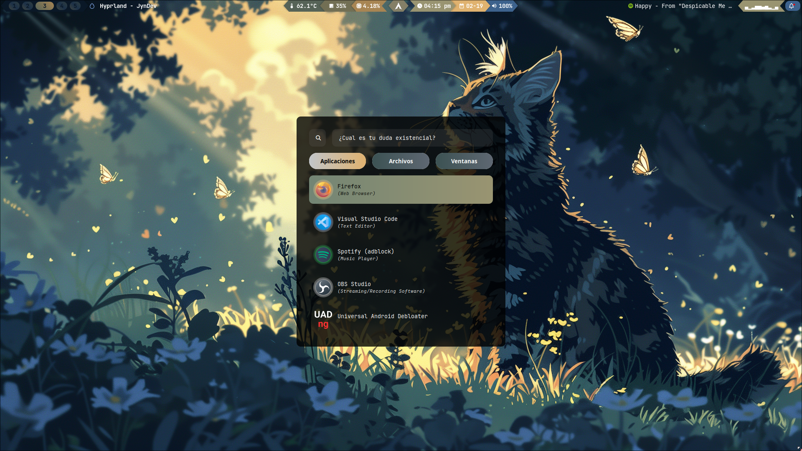</img> 
</div>


✨ **Centro de Notificaciones (Swaync)**
<div align="center">
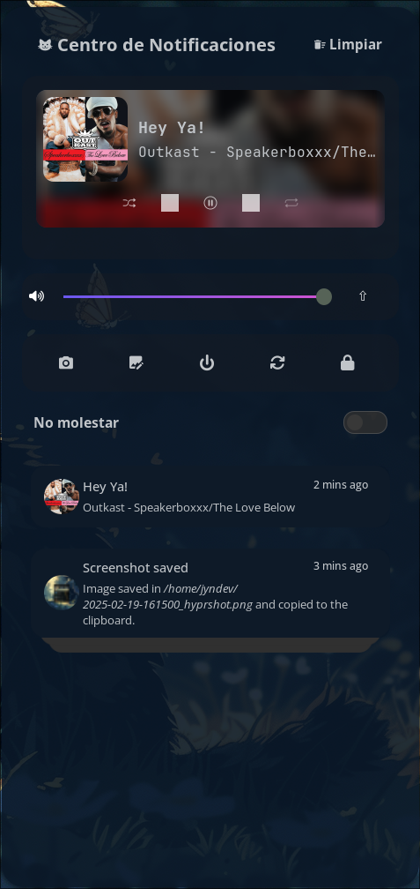</img> 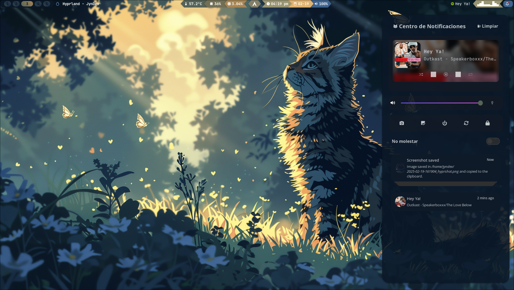</img> 
</div>

🌃 **Barra de tareas (Waybar)**
<div align="center">
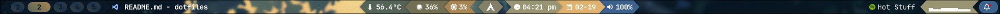</img>
</div>

## 🛠️ Instalacion

⚠️ **Importante:**
Instalar todos los paquetes antes de realizar cualquier copia de configuraciones

⚙️ **Configuracion de terminal de comandos**
Instalar los siguientes paquetes:
- **git** (Sistema de control de versiones)
- **zsh** (intérprete de comandos)
```bash
sudo pacman -S git zsh
```
Cambiar la shell por defecto del usuario en el sistema 
```bash
chsh -s /bin/zsh
```
- **yay** (helper de AUR) *Algunos paquetes solo estan disponibles en AUR* 
```bash
sudo pacman -S --needed base-devel && git clone https://aur.archlinux.org/yay.git && cd yay && makepkg -si
```
**🔃 Reinicia el equipo**
-  **Oh My ZSH** (Framework para gestionar la configuraciones de ZSH)

    - **Plugins de zsh**
        - zsh-autosuggestions
        - zsh-syntax-highlighting
        - zsh-history-substring-search

    Despues de instalados agregalos en el archivo de configuracion ".zshrc" que esta en el directorio "home"

- **Power level 10k**

    Para darle mas vida y estilo a la terminal puedes descargar este pequeño paquete

- **Alias de comandos**

    Para optimizar tiempo, puedes agregar los siguietes alias en el archivo de configuracion *.zshrc*
    ```sh
    alias install="sudo pacman -S"
    alias aur_install="yay -S"
    alias update="sudo pacman -Syu"
    alias purge="sudo pacman -Rns"
    ```

🧰 **Paquetes a instalar (Importantes para la personalizacion)**

```bash
    install chafa gnome-tweaks swww hyprlock neofetch rofi-wayland nemo cinnamon-translations waybar ttf-jetbrains-mono-nerd swaync zenity bc eog gnome-system-monitor evince openrgb xdg-desktop-portal-hyprland xdg-desktop-portal-gtk
```
```bash
    aur_install wlogout hyprshot cava visual-studio-code-bin python-pywal16 mpvpaper
```

🧰 **Paquetes a instalar**


- **Musica**
    ```bash
    aur_install spotify #Instalas e inicias sesion
    aur_install spotify-adblock #Eliminar publicidad
    ```
## 🎨 Temas y personalizacion

- 🏙️ **Iconos:** *Magna-Dark-Icons*
- 🖍️ **Tema:** *Lavanda-gtk-theme*
- 🗚 **Fuente:** *Century Gothic*
- 🖱️ **Mouse:** *Anya-cursor-v3*


📄 **Fuentes adicionales (Japones)**

```bash
install noto-fonts-cjk
install noto-fonts-emoji
install noto-fonts
```

## ✅ Pasos finales

Copia todos los archivos que se encuentran dentro de _".config"_ a este mismo directorio dentro de tu carpeta _"home"_

- **NOTA:** Es muy probable que tengas errores, esto debido a que tienes que ir depurando y corrigiendo rutas dentro de los archivos cambiando solo algunas partes con el nombre de tu usurio

- **Directorios que debes crear:**

    - En tu directorio _".cache"_ debes crear los siguientes directorios:
        - **hyprlock** Aqui se guarda la configuracion del fondo de pantalla de bloqueo
        - **albumart** Directorio donde se almacenan las imagenes de las portadas de las canciones en reproduccion
        - **liveWallpaper** Directorio dobde se almacena el fondo de pantalla animado

## ⚠️ Primer arranque
Debes iniciar los colores de pywal para no generar errores al momento de reiniciar el equipo
```bash
wal --cols16 -i "ruta_absoluta_de_tu_imagen"
```

## 🔒 Fondo de SDDM
El Script de fondos de pantalla integrado permite cambiar el fondo de pantalla de sddm de forma dinamica y facil

Si no esta configurado todo de una forma correcta se mostrara un error para asegurar la integridad

- **Tema actual: sddm-astronaut-theme**

Como primer paso debes acceder a la ruta donde tienes el tema justo en el directorio donde estan los fondos,
**en mi caso es: _/usr/share/sddm/themes/sddm-astronaut-theme/Backgrounds_**

- **Damos permisos totales al directorio donde almacenaremos los archivos**
    ```bash
    sudo chmod 777 /usr/local/etc
    ```
- **Creamos el directorio dedicado a SDDM**
    ```bash
    mkdir /usr/local/etc/sddm
    ```
- **Comando para crear el enlace simbolico**
    ```bash
    sudo ln -s /usr/local/etc/sddm/sddm_background /usr/share/sddm/themes/sddm-astronaut-theme/Backgrounds/background
    ```
- En la configuracion del tema debemos modificar la linea donde se encuentra definido el fondo, en mi caso es:
    ```bash
    # "Background es el enlace simbolico creado anteriormente"
    #################### Background ####################
    Background="Backgrounds/background"
    ```
**Ejecuta el script de cambio de fondo de pantalla**
